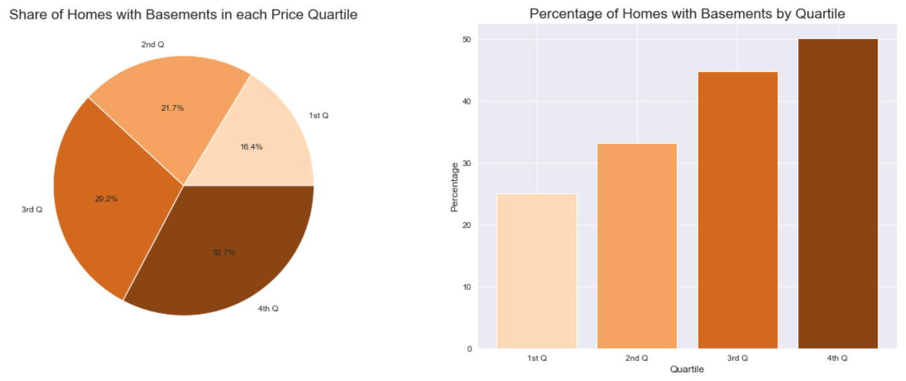

# Phase 2 Final Project

Student name: Kourosh Alizadeh  
Student pace: full time  
Scheduled project review date/time: 10/12/2020, 3pm EST  
Instructor name: Rafael Carrasco  
Blog post URL: TBD  

### This Repo Contains:
- notebook analyzing data from the King's County Housing dataset
- a script of useful functions, libraries, and graphing set-up
- a slide deck presentation of our findings
- .png files of our graphs and regression model statistics
- a data folder with the relevant data and a description of it

### Outline

1. Introduction
2. Primary Research Questions Answered
3. Regression Model
4. Recommendations and Future Research


## 1. An Examination of the Housing Habits of the Human Aliens

To my dear and esteemed colleagues of the Alien Species Research Comission:

Thanks to our brave agents in the field, we have recently acquired some data on patterns regarding the artifical habitats humans have created for themselves in a place called King's County. 

In this report, we use this data to examine what features humans value in a dwelling. In particular, we look at the following questions:

- Do humans prefer to live near water or to live more inland where it is safer?
- Do humans like to have a lot of empty land around them?
- Do humans like to live high above the ground?
- Do humans enjoy living deep below the ground?
- Do humans use their eyes for pleasure or only survival?

Finally, we build a model using multlinear regression to estimate how a human might value a house based on its features. Our goal in doing this is, as always, to (1) improve the placement of our agents in the future so we can understand these aliens better and better, and (2) learn how we can help them in the future. 

To begin with, let's look at the results for each question:

## 2. Primary Research Questions Answered

### 2.a Do humans prefer to live near water?


Yes, they do. Houses built near the water predominantly among the most expensive.


### 2.b Do humans like to have empty land around them?


There does not seem to be any connection between the amount of surrounding space a house has and a human's willingness to expend financial tokens for its purchase.

### 2.c Do humans value living high above the ground?


Yes, they do. There are more tall homes among the upper quartile than there are among lower quartiles. 

### 2.d Do humans enjoy living deep beneath the ground?



Yes. Basements, like access to water and high floors, also seemed to be more common among more expensive homes. 

### 2.e Do humans use their eyes for pleasure?


Yes. While some had argued previously that the human eye was simply a way of sensing radiation for survival purposes, humans do seem to value experiencing certain patterns of radiation more than others, regardless of survivability. They are willing to spend more on homes that enable them to experience these preferred patterns more often.

## 3. Our Regression Model

We used most of these features, as well as the log sqftage of the living space in each artifical habitat, to build a multiple regression model.


The strongest coefficient was the one associated with the log of living space. As that number goes up, so too does the log of price. The coefficients of the basement and the high floors features were negative. This is a little surprising, since we know there is a positive correlation between these features and the price of homes. But their negative contribution here must be a sign of them balancing out some other feature, likely the living space one. Last, the view features did not contribute too much to our model, but they did do something, and their p-values indicate that they were reasonably significant.

## 4.a Recommendations

1. Future agents should be placed in tall locations near water so that they can better attract humans. Indeed, this to some degree explains Agent Gates’ famous effectiveness  
2. Agents will need training on simulating/stimulating eye-pleasure in humans  
3. Once we pivot from observing to helping the humans, we should consider aerial bombardment to create craters and thus more water features for them to build houses near.


## 4.b Future Research

1. It would be interesting to look more at the connection between the view rating and a house's placement. What kinds of views do humans enjoy? Views of liquid water, other constructions, or simply of the sky?  
2. We'd like to explore other methods of modelling. The latitude feature seemed promising, and its connection to human housing desires may indicate that humans have some sort of magnetic sense that leads them to prefer certain latitudes over others. Unfortunately it had too much collinearity with other features for us to use it in our final model. Perhaps other kinds of models might be able to make better use of it.

I hope you find this report informative. May your future be filled with many grand excursions among the stars. Thank you.


```python

```
