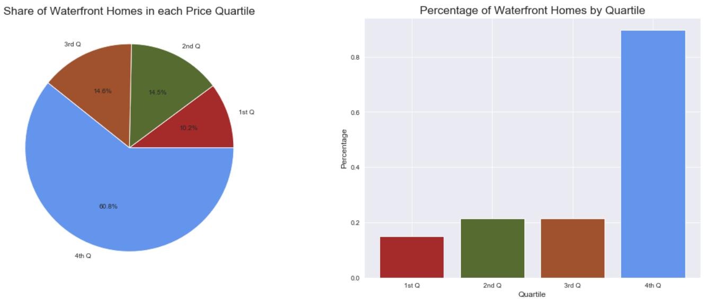

# Phase 2 Final Project


Student name: Kourosh Alizadeh  
Student pace: full time  
Scheduled project review date/time: 10/12/2020, 3pm EST  
Instructor name: Rafael Carrasco  
Blog post URL: TBD  

## An Examination of the Housing Habits of the Human Aliens

To my dear and esteemed colleagues of the Alien Species Research Comission:

Thanks to our brave agents in the field, we have recently acquired some data on patterns regarding the artifical habitats humans have created for themselves in a place called King's County. 

In this report, we use this data to examine what features humans value in a dwelling. In particular, we look at the following questions:

1. Do humans prefer to live near water or to live more inland where it is safer?
2. Do humans like to have a lot of empty land around them?
3. Do humans like to live high above the ground?
4. Do humans enjoy living deep below the ground?
5. Do humans use their eyes for pleasure or only survival?

Finally, we build a model using multlinear regression to estimate how a human might value a house based on its features. 

To begin with, let's look at the results for each question:

### 1. Do humans prefer to live near water?



Yes, they do. Houses built near the water predominantly among the most expensive.


```python

```
